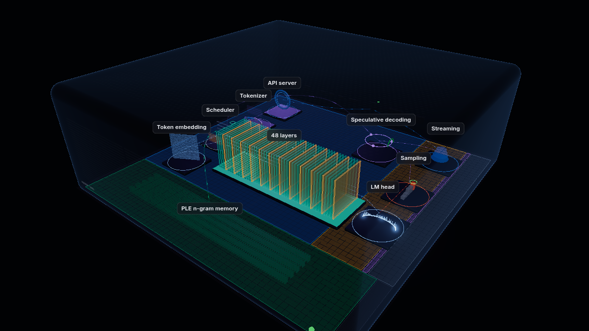

# Anatomy of a Token

**A step-by-step, explorable 3D walkthrough of what happens inside a language-model server when it answers a question: your question, on your model, on your hardware.**



Type a question. The page runs it on the model your server is serving, then walks you through every stage: the tokens your text became, the vectors they turned into, every layer of the real architecture, the experts that fired, the probabilities of each word, the speculative drafts that were accepted or rejected, and every engine step of the reply as it streamed back. Each step has three depths:

| Depth | For | Example (the attention step) |
|---|---|---|
| **Overview** | anyone | “Each token makes a query (‘what am I looking for?’); every earlier token offers a key and a value…” |
| **Technical** | students, engineers | “24 query heads share 2 key/value heads (grouped-query attention), which makes the KV cache 12× smaller…” |
| **Under the hood** | practitioners | “softmax(q·kᵀ/√256)·v; RoPE on 25% of each head; the KV cache is FP8…” |

The 3D map stays live the whole time: orbit, zoom, click any station or layer, step through tokens, or switch on **Live** to watch the server’s real counters animate the scene.

## It is always the model you are running

Nothing about the model is hard-coded. A small **probe** runs beside your inference server and reads:

- the checkpoint’s own `config.json` (or GGUF metadata): layers and their types, heads, experts, vocabulary, context;
- the **tensor headers** of the weight files, without loading a single weight: real parameter counts and bytes per part (experts, attention, embeddings…);
- the server’s **launch flags and metrics**: batch size, prefill chunk, KV-cache size and precision, speculative-decoding depth;
- the **machine**: GPU, memory, whether memory is unified.

The page builds its scene from that profile. A 64-layer dense model gets 64 plain layers and a feed-forward block; a hybrid model shows its DeltaNet and attention layers in their real pattern; a mixture-of-experts model gets a grid with the real number of experts, lit top-k at a time. Steps for features a model does not have (speculative decoding, phrase memory, linear attention) simply do not appear. When the server switches models, the page notices and offers to rebuild.

Every number on the page carries a tag saying where it came from: `config.json`, `tensor headers`, `server`, `your request`, `this machine`, `estimate`, or hand-written `notes`.

## Quick start

You need Python 3.9+ (standard library only) on the machine that runs the model, and a vLLM or llama.cpp server.

```bash
git clone https://github.com/gaiato/anatomy-of-a-token && cd anatomy-of-a-token/probe
python3 -m anatomy_probe serve --engine http://127.0.0.1:8000 --web ../web
# open http://<that machine>:1239/
```

- `--engine` can repeat: the first server that answers is the one described (e.g. vLLM, then a llama.cpp fallback).
- The probe finds the checkpoint from what the server reports: an absolute path, the Hugging Face cache by repo id, or `--search DIR` / `--model-map NAME=PATH`.
- `--hardware-name "My Workstation"` names the machine on the page.

No server handy? Open `web/` with any static file server and add `?demo`: the page runs on the saved snapshot in `web/data/snapshot/` (a real capture from Qwen3.8-Flash-Next on an ASUS Ascent GX10).

Make your own snapshot to share: `python3 -m anatomy_probe snapshot --engine URL --out web/data/mymodel --prompt "…"`, then open `?demo&snapshot=mymodel`.

## Privacy

The probe stores nothing. A visitor’s question exists only for the length of the request: it is tokenized, answered (capped at 48 tokens), and the result returned to that browser. Prompts are never logged. The page asks visitors not to type personal information. Live mode reads only aggregate counters (tokens per second, cache use), never anyone’s prompts or replies. Launch flags pass an allowlist, so API keys and paths never leave the machine.

## How it fits together

```
browser ── GET /api/profile ──▶ anatomy-probe ── reads ──▶ config.json, tensor headers, /proc/<engine>/cmdline, nvidia-smi
        ── POST /api/trace ──▶      │         ── calls ──▶ engine /tokenize + /v1/chat/completions (logprobs, streamed)
        ── GET /api/metrics ─▶      │         ── proxies ▶ engine /metrics
        ── GET /api/status ──▶      └──────── live GPU power, temperature, memory
```

| Path | What it is |
|---|---|
| `probe/anatomy_probe/` | the probe: `profile.py` (normaliser), `weights.py` (safetensors + GGUF headers), `engine.py` (vLLM / llama.cpp), `launch.py`, `hardware.py`, `server.py` |
| `web/js/model.js` | profile + trace → every number the page shows |
| `web/js/scene.js` | the three.js scene, built from the view model |
| `web/js/story.js` | the walkthrough: 18 steps × 3 depths, templated over the model and your request |
| `web/js/packs/` | optional hand-written notes for specific models and hardware |
| `docs/` | the profile format and how to write a pack |

## Packs: adding what no config file says

A config file says a model has 512 experts; it does not say why a recipe stores them in 4-bit, or what was measured on a particular box. **Packs** add that: a model pack matches on the profile and appends notes to steps at the Technical or Under-the-hood depth, each with its source; a hardware pack names the machine, its memory bandwidth and its quirks. See `docs/PACKS.md`. The repo ships one of each: Qwen3.8-Flash-Next (MiaAI-Lab single-Spark recipe) and NVIDIA GB10 (DGX Spark / ASUS Ascent GX10).

## Tests

```bash
python3 -m unittest discover -s probe/tests
```

## Deploying

One process is enough: `serve --web ../web` serves the page and the API together on port 1239. To keep it running, `deploy/example/anatomy-probe.service` is a systemd unit to copy and edit.

To put the page under a site you already run, serve `web/` statically and proxy `/api/` to the probe; `deploy/example/nginx.conf` shows the two locations (keep `proxy_buffering off`, the trace streams). `deploy/example/config.js` shows the page settings: where the API is, a back link to your site, the reply length.

If your audience is students, read **Privacy** above and consider leaving the page in demo mode (no probe at all), or running the probe only during a lesson.

## License

MIT, see `LICENSE`. three.js under `web/vendor/` keeps its own MIT license.

## Credits

Built in a home lab with Claude Code. The first version’s telemetry parser and headless test harness were written by a local model running on the same GX10 the page describes. three.js (MIT) is vendored under `web/vendor/`.
