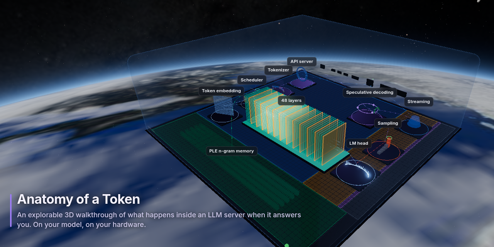

# Anatomy of a Token

**A step-by-step, explorable 3D walkthrough of what happens inside a language-model server when it answers a question: your question, on your model, on your hardware.**



Type a question. The page runs it on the model your server is serving, then walks you through every stage: the tokens your text became, the vectors they turned into, every layer of the real architecture, the experts that fired, the probabilities of each word, the speculative drafts that were accepted or rejected, and every engine step of the reply as it streamed back. Each step has three depths:

| Depth | For | Example (the attention step) |
|---|---|---|
| **Overview** | anyone | “Each token makes a query (‘what am I looking for?’); every earlier token offers a key and a value…” |
| **Technical** | students, engineers | “24 query heads share 2 key/value heads (grouped-query attention), which makes the KV cache 12× smaller…” |
| **Under the hood** | practitioners | “softmax(q·kᵀ/√256)·v; RoPE on 25% of each head; the KV cache is FP8…” |

The 3D map stays live the whole time: orbit, zoom, click any station or layer, step through tokens, or switch on **Live** to watch the server’s real counters animate the scene.

## It is always the model you are running

Nothing about the model is hard-coded. A small **probe** runs beside your inference server and reads:

- the checkpoint’s own `config.json` (or GGUF metadata): layers and their types, heads, experts, vocabulary, context;
- the **tensor headers** of the weight files, without loading a single weight: real parameter counts and bytes per part (experts, attention, embeddings…);
- the server’s **launch flags and metrics**: batch size, prefill chunk, KV-cache size and precision, speculative-decoding depth;
- the **machine**: GPU, memory, whether memory is unified.

The page builds its scene from that profile. A 64-layer dense model gets 64 plain layers and a feed-forward block; a hybrid model shows its DeltaNet and attention layers in their real pattern; a mixture-of-experts model gets a grid with the real number of experts, lit top-k at a time. Steps for features a model does not have (speculative decoding, phrase memory, linear attention) simply do not appear. When the server switches models, the page notices and offers to rebuild.

Every number on the page carries a tag saying where it came from: `config.json`, `tensor headers`, `server`, `your request`, `this machine`, `estimate`, or hand-written `notes`.

## Quick start

### 1. Look around first (demo, nothing to install)

```bash
git clone https://github.com/gaiato/anatomy-of-a-token && cd anatomy-of-a-token/web
python3 -m http.server 8000
# open http://localhost:8000/
```

The page runs on a saved capture of Qwen3.8-Flash-Next on an ASUS Ascent GX10 (`web/data/snapshot/`) and says so in a banner. Any static file server works; opening `index.html` straight from disk does not (browsers block modules on `file://`).

### 2. See your own model (live)

You need a model served by **vLLM** or **llama.cpp's `llama-server`**, and Python 3.9+ on the **same machine** (the probe reads the model's files from disk). Nothing to install: the probe is the Python standard library.

```bash
cd anatomy-of-a-token/probe
python3 -m anatomy_probe serve --engine http://127.0.0.1:8080 --web ../web    # llama-server's default port
python3 -m anatomy_probe serve --engine http://127.0.0.1:8000 --web ../web    # or vLLM's
# open http://localhost:1239/
```

It worked when the banner is gone and the top bar names your model. If the page still says **Demo data**, the banner says why:

| The banner says | What to do |
|---|---|
| No probe answered | Open the probe's address (`:1239`), not a separate static server. |
| The probe is running but no model server answered | Check the `--engine` URL: `curl http://127.0.0.1:8080/v1/models` should list your model. |
| The probe could not find the model's files | Point it at them: `--search DIR` (a folder that holds model folders or `.gguf` files) or `--model-map NAME=PATH`. |

More options:

- **Show it to others on your network:** add `--bind 0.0.0.0`, then open `http://<that machine>:1239/`. Anyone who can reach the page can ask your model short questions (48 tokens at most, one at a time); read **Privacy** first.
- `--engine` can repeat: the first server that answers is the one described (e.g. vLLM, then a llama.cpp fallback).
- `--hardware-name "My Workstation"` names the machine on the page (otherwise its GPU or host name).
- If the server needs an API key, set `ANATOMY_API_KEY` rather than passing `--api-key`, so the key stays out of the process list. The probe uses it only to call the server; it never reaches the page.
- Make a snapshot to share: `python3 -m anatomy_probe snapshot --engine URL --out web/data/mymodel --prompt "…"`, then open `?demo&snapshot=mymodel`.

## What works

| | |
|---|---|
| **Servers** | vLLM and llama.cpp `llama-server`: everything (exact tokens, top-5 probabilities, live counters, launch settings). Ollama, LM Studio and other OpenAI-compatible servers are not supported yet: they do not expose the tokenizer, and some not the model's files or probabilities. |
| **Models** | Nothing to add: the page is built from whatever the server is serving. Any decoder-only transformer whose `config.json` or GGUF metadata the probe can read: dense or mixture-of-experts; multi-head, grouped-query, multi-query or latent (MLA) attention; sliding windows; hybrid linear-attention (Gated DeltaNet) and Mamba layers; MTP drafters. Weights as a safetensors folder (any folder or the Hugging Face cache) or a GGUF file, split or not. |
| **Tested on** | Qwen3.8-Flash-Next NVFP4 on vLLM (NVIDIA GB10, unified memory); Qwen2.5-0.5B-Instruct Q4_K_M GGUF on llama.cpp (CPU only); Qwen3-VL-32B and Flash-Next configs in the unit tests. Please report others (see `CONTRIBUTING.md`). |
| **Systems** | Linux: everything. Windows: works, without launch settings (no `/proc` to read them from). macOS: Apple-silicon GPU and memory are detected, but it has not been tested on a Mac yet. |
| **Notes** | Every model gets the general explanations with its own real numbers. Hand-written model notes (packs) exist for Qwen3.8-Flash-Next only; `docs/PACKS.md` shows how to add one. |

## Privacy

The probe stores nothing. A visitor’s question exists only for the length of the request: it is tokenized, answered (capped at 48 tokens), and the result returned to that browser. Prompts are never logged. The page asks visitors not to type personal information. Live mode reads only aggregate counters (tokens per second, cache use), never anyone’s prompts or replies. Launch flags pass an allowlist, so API keys and paths never leave the machine. The page loads everything (scripts, fonts, images) from its own folder. Its only outside request is the background (below) asking CelesTrak for the space station's latest orbital elements, at most once every six hours per browser; set `sky: { orbit: null }` in `web/config.js` to use the bundled elements and make no outside request at all, or `sky: null` for a plain background.

## How it fits together

```
browser ── GET /api/profile ──▶ anatomy-probe ── reads ──▶ config.json, tensor headers, /proc/<engine>/cmdline, nvidia-smi
        ── POST /api/trace ──▶      │         ── calls ──▶ engine /tokenize + /v1/chat/completions (logprobs, streamed)
        ── GET /api/metrics ─▶      │         ── proxies ▶ engine /metrics
        ── GET /api/status ──▶      └──────── live GPU power, temperature, memory
```

| Path | What it is |
|---|---|
| `probe/anatomy_probe/` | the probe: `profile.py` (normaliser), `weights.py` (safetensors + GGUF headers), `engine.py` (vLLM / llama.cpp), `launch.py`, `hardware.py`, `server.py` |
| `web/js/model.js` | profile + trace → every number the page shows |
| `web/js/scene.js` | the three.js scene, built from the view model |
| `web/js/sky.js` | the background: the station's orbit, Earth, Sun, Moon and stars, computed from the clock |
| `web/js/story.js` | the walkthrough: 18 steps × 3 depths, templated over the model and your request |
| `web/js/packs/` | optional hand-written notes for specific models and hardware |
| `docs/` | the profile format and how to write a pack |
| `record/` | turns the walkthrough into a video, frame by frame, from a JSON shot list (see `record/README.md`) |

## The view from orbit

Behind the scene is the view from the International Space Station, right now: the station's position from its orbital elements (fetched from CelesTrak, with a bundled fallback), Earth turning beneath it at the real sidereal rate with day, night and city lights where they are this minute, the Sun and the Moon where they are, and 9,096 stars from the Yale Bright Star Catalogue precessed to today, over NASA's Milky Way map. The floor of the scene faces away from Earth and the server flies along the orbit, so the ground slides by at 7.7 km/s and the stars turn once every 92 minutes. A note in the corner says where the station is; click it for a slider over the next 24 hours of orbit, its strip showing where the ground below is in daylight, so you can choose the view (the scene keeps orbiting from there; **Live** returns to now). List places in `sky.places` in `web/config.js` and the slider marks the passes over them. `web/js/sky.js` is the code; `web/data/sky/SOURCES.md` lists the data and credits.

To preview another moment: `?skyat=2026-10-01T21:25Z` (any ISO time), `?skywarp=60` (sixty times faster). `?sky=0` turns it off.

## Packs: adding what no config file says

A config file says a model has 512 experts; it does not say why a recipe stores them in 4-bit, or what was measured on a particular box. **Packs** add that: a model pack matches on the profile and appends notes to steps at the Technical or Under-the-hood depth, each with its source; a hardware pack names the machine, its memory bandwidth and its quirks. See `docs/PACKS.md`. The repo ships one of each: Qwen3.8-Flash-Next (MiaAI-Lab single-Spark recipe) and NVIDIA GB10 (DGX Spark / ASUS Ascent GX10).

## Tests

```bash
python3 -m unittest discover -s probe/tests
```

## Deploying

One process is enough: `serve --web ../web` serves the page and the API together on port 1239. To keep it running, `deploy/example/anatomy-probe.service` is a systemd unit to copy and edit.

To put the page under a site you already run, serve `web/` statically and proxy `/api/` to the probe; `deploy/example/nginx.conf` shows the two locations (keep `proxy_buffering off`, the trace streams). `deploy/example/config.js` shows the page settings: where the API is, a back link to your site, the reply length.

If your audience is students, read **Privacy** above and consider leaving the page in demo mode (no probe at all), or running the probe only during a lesson.

## License

MIT, see `LICENSE`. three.js under `web/vendor/` keeps its own MIT license. The fonts in `web/fonts/` (Inter, JetBrains Mono) are under the SIL Open Font License 1.1. The sky data under `web/data/sky/` is public-domain or NASA imagery used with credit; see `web/data/sky/SOURCES.md`.

## Credits

Built in a home lab with Claude Code. The first version’s telemetry parser and headless test harness were written by a local model running on the same GX10 the page describes. three.js (MIT) is vendored under `web/vendor/`. Sky: Yale Bright Star Catalogue (Hoffleit & Warren); NASA Earth Observatory (Blue Marble Next Generation, Black Marble); NASA/Goddard Scientific Visualization Studio (Deep Star Maps 2020, with Gaia DR2: ESA/Gaia/DPAC); orbital elements from CelesTrak.
